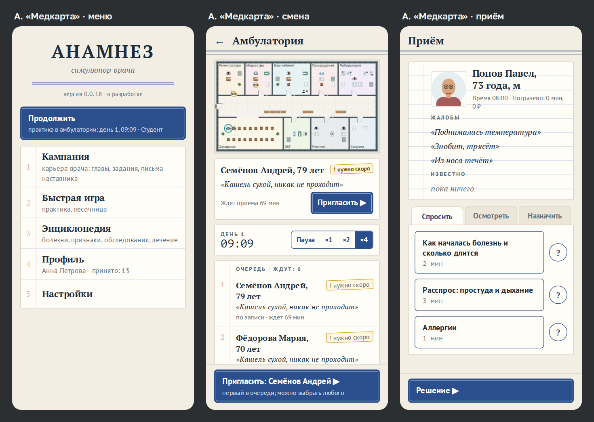
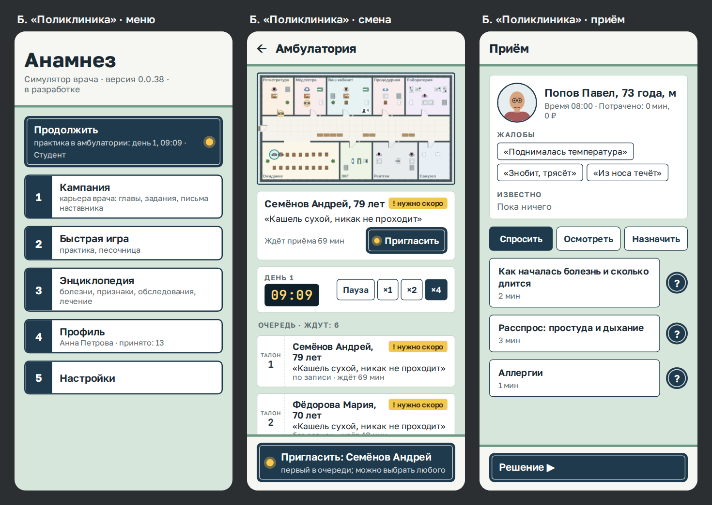
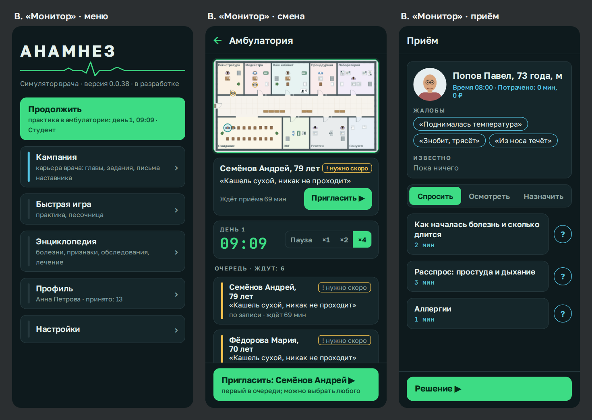
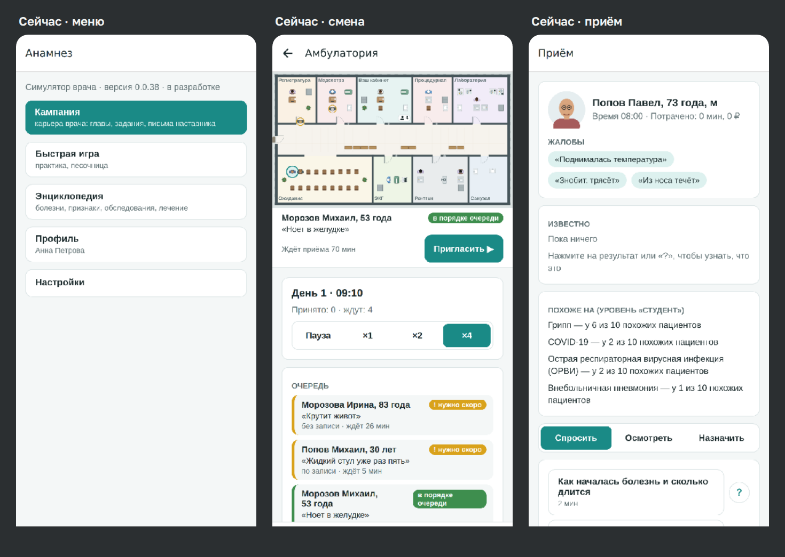

# Свой вид меню и кнопок

**Версия:** 0.0.39–0.0.40 (этап 7 заранее; ADR [0017](../adr/0017-own-look.md)) **Состояние:**
решено — две темы: светлая «Медкарта» и тёмная «Монитор» (владелец, 28.09.2026); часть 24
сделана (0.0.39), часть 25 — следующая

## Зачем

Владелец решил 28.09.2026: «Анамнез» — исключение из брендбука студии. Меню и кнопки
получают свой вид, подобранный под игру (ADR 0017).

Сейчас интерфейс — как у любого приложения: белые карточки, бирюзовые кнопки, системный
шрифт. По снимку в магазине игру не узнать. Главная кнопка к тому же бледновата: белое на
бирюзовом — контраст 4,2 к 1, а для текста кнопки нужно не меньше 4,5.

Эта спецификация предлагает три направления с картинками. Владелец выбирает одно, и по
нему переделываются общие элементы и экраны. Картинки — макеты на HTML с настоящими
текстами игры. План больницы и портрет в них — снимки веб-сборки. Готовый вид в игре будет
близким к макету, но не до точки.

## Что не меняется

При любом направлении:

- **Рисунок плана больницы** — как в живой карте
  ([`2026-09-living-map.md`](2026-09-living-map.md)). Меняется только то, что вокруг плана.
- **Срочность** — цветом **и** словом со значком: жёлтый — «нужно скоро», красный —
  «срочно».
- **Касание** не меньше 48 dp (NFR-ACC-1). Размер текста из настроек и системный размер
  шрифта действуют, как сейчас.
- **Голос текстов** — прежний: «ёлочки», без восклицательных знаков.
- **Правила брендбука, которые остаются** (ADR 0017):
  - в «Об игре» — знак студии, строка «Игра студии „Горница“» и полоса-рушник;
  - иконка;
  - снимки для магазина;
  - без заставки при запуске.
- **Картинки — плоско и кодом.** Без фактур, теней и бликов, без генераторов изображений.
- **Шрифты — в сборке**, под открытой лицензией OFL, без сети.

## Три направления

### А. «Медкарта»

Интерфейс — медицинские документы: история болезни, журнал приёма, бланк.

- **Цвета:**
  - фон — бумага (`#F3EEE3`), листы чуть светлее (`#FFFDF8`);
  - текст — тёмные чернила (`#1F2D3D`);
  - главная кнопка — синие чернила (`#2B4E8C`).
- **Шрифты:** заголовки и имена — PT Serif, остальное — PT Sans, часы — PT Mono. Все три от
  ParaType, сделаны для кириллицы, лицензия OFL.
- **Меню — обложка карты.** «АНАМНЕЗ» прописными над двойной чертой. Пункты — строки
  журнала, номер на поле за красной линией.
- **Карта пациента — лист истории болезни.**
  - Голубая линовка, поле красной линией.
  - Жалобы записаны курсивом по строкам, как со слов пациента.
  - Вкладки «Спросить / Осмотреть / Назначить» — закладки картотеки.
- **Кнопки:**
  - главная — оттиск штампа: синяя, с тонкой светлой рамкой внутри;
  - вторая — лист с синей рамкой;
  - справка «?» — синий круг.
- **Плашка срочности** — как штамп, чуть повёрнута. Цвет и слово прежние.

**Хорошо:**
- «Анамнез» — это раздел истории болезни. Вся игра — расспрос, обследования и решение, то
  есть заполнение карты. Документы говорят об этом с первого экрана.
- Длинные тексты — карту пациента, энциклопедию, разбор — легко читать.
- План больницы — тоже чертёж на бумаге: план и интерфейс — одно целое.

**Риск:** может показаться старомодным. Бумагу легко перегрузить украшениями. Держим
плоско: цвет, линии, шрифт — без фактуры бумаги, пятен и теней.

### Б. «Поликлиника»

Интерфейс — коридор поликлиники: стены, выкрашенные до половины, эмалированные таблички,
табло очереди.

- **Цвета:**
  - фон — светло-зелёная масляная краска стен (`#D6E6DA`);
  - шапка — побелка (`#F6F7F2`) с полосой по границе краски;
  - таблички — тёмно-синие (`#1E3A4C`).
- **Шрифты:** Golos Text — ParaType, для сайтов государственных и социальных служб, лицензия
  OFL. Цифры табло — JetBrains Mono, тоже OFL.
- **Меню — таблички на дверях:** номер кабинета в синей клетке и название.
- **Кнопки:**
  - главная — эмалированная табличка: белые буквы, тонкая белая рамка внутри;
  - у «Продолжить» и «Пригласить» — жёлтая лампа вызова, как над дверями на карте.
- **Смена:** часы — электронное табло, жёлтые цифры на тёмном; очередь — талоны с номером.

**Хорошо:**
- Узнаваемо для игрока, который бывал в поликлинике.
- Прямо связано с планом: лампы, кабинеты, таблички.
- Кнопки крупные и чёткие.

**Риск:**
- Ностальгия понятна не всем.
- Тёмные таблички тяжелы для длинных экранов. Поэтому текст — на белых досках, таблички —
  только у кнопок.

### В. «Монитор»

Ночная смена у прикроватного монитора: тёмный фон, цвета кривых.

- **Цвета:**
  - фон — `#0E1A1D`, панели — `#15262A`, текст светлый;
  - главная кнопка — зелёная, цвета ЭКГ (`#3DDC84`), с тёмными буквами;
  - справки и время — бирюзовые, цвета сатурации.
- **Шрифты:** Golos Text и JetBrains Mono (OFL).
- **Меню:** название, под ним кривая ЭКГ. Часы смены — крупные зелёные цифры.
- **План больницы** — светлый, в зелёной рамке, как снимок на негатоскопе.

**Хорошо:** современный игровой вид, ярко в магазине, ночью меньше слепит.

**Риск:**
- Длинные тексты на тёмном читать тяжелее.
- Светлый план на тёмном фоне — два разных мира.
- Жёлтый и красный срочности спорят с зелёным и бирюзовым.
- Тёмных приложений много — узнаваемость ниже.

### Сейчас — для сравнения

## Сравнение

| | А. «Медкарта» | Б. «Поликлиника» | В. «Монитор» |
|---|---|---|---|
| Длинные тексты | легко: тёмное на светлом, шрифт для чтения | легко: текст на белых досках | тяжелее: светлое на тёмном |
| Связь с планом больницы | план — чертёж на той же бумаге | лампы и таблички — как на плане | план — светлое пятно на тёмном |
| Узнаваемость в магазине | высокая | высокая | средняя |
| Срочность (жёлтый, красный) | отдельно от синего | отдельно от синего; жёлтая лампа — вызов, у неё нет слова | спорит с зелёным и бирюзовым |
| Контраст главной кнопки | 8,2 к 1 | 11,9 к 1 | 8,6 к 1 |
| Шрифты в APK | PT Serif, PT Sans, PT Mono — около 1,4 МБ | Golos Text, JetBrains Mono — около 0,4 МБ | Golos Text, JetBrains Mono — около 0,5 МБ |
| Объём работы | больше: линовка, закладки, обложка | средний | меньше: цвета и шрифт |

Предел APK — 100 МБ (NFR-SIZE-1). Шрифты любого направления его не заметят.

## Рекомендация

**А. «Медкарта».**

1. Игра называется по разделу истории болезни, и весь приём — заполнение карты. Вид
   документов говорит, что это за игра, с первого экрана и снимка в магазине.
2. Главное чтение в игре — карта пациента, энциклопедия, разбор. Тёмное на светлом и
   шрифты ParaType для кириллицы — лучшее для долгого чтения.
3. План больницы — чертёж, и бумага с чертежом — одно целое. Интерфейс и карта не
   спорят.
4. Синие чернила не спорят ни со срочностью (жёлтый, красный), ни с бирюзовым выделением
   на карте.
5. Спокойно, как требует устав: вид не торопит.

Можно и смешать — например, «Медкарта» с лампой вызова «Поликлиники» у «Пригласить».

## Решение владельца

28.09.2026: нравятся все три; если три — слишком много, оставить «Монитор» тёмной темой и
одну из светлых — какая профессиональнее. «Медкарта» светлее и чище, «Поликлиника» богаче,
и цвета её похожи на программы поликлиник, но кого-то она может перегрузить.

Выбрано:
- **Две темы.** Светлая — «Медкарта»: чище, спокойнее для долгого чтения. Тёмная —
  «Монитор».
- **Третьей темы нет.** Каждый новый экран пришлось бы делать и проверять трижды, а
  «Поликлиника» с табличками и талонами кого-то перегрузит.
- **Одна деталь «Поликлиники» переходит в обе темы** — лампа вызова у «Пригласить»: она
  перекликается с лампами над дверями на плане.
- **Тема — в настройках:** «Как в телефоне» (по умолчанию), «Светлая», «Тёмная».
  Меняется сразу, без перезапуска.

## Что увидит игрок

Светлая «Медкарта» или тёмный «Монитор» — по теме телефона или по выбору в настройках — на
всех экранах:

- меню;
- очередь смены, карта пациента, «Решение», итог приёма, итоги дня;
- энциклопедия, профиль, настройки, «Об игре»;
- стройка и персонал своей больницы;
- кампания.

План больницы, портреты и снимки — прежние.

## Данные

- **Состояние, сохранения, база** — без изменений.
- **`src/ui/theme.ts`** — две темы: цвета, размеры, шрифты. Экраны берут их только
  отсюда, через тему на сейчас, а не из постоянных при загрузке модуля: тема меняется без
  перезапуска.
- **Настройки** — поле `theme`: `system` (по умолчанию), `light`, `dark`. Сохранения игры не
  меняются.
- **`src/ui/components.tsx`** — общие элементы в новом виде: экран и шапка, лист, кнопки
  (главная, вторая, справка), вкладки, плашки, лист поверх экрана, переключатель.
- **`src/ui/text.tsx`** — шрифт по начертанию: обычный, полужирный, курсив.
- **Шрифты** — файлы TTF в сборке, рядом текст лицензии OFL. На Android начертания
  собираются в одно семейство через `expo-font`; в веб-сборке — те же файлы.
- **`03-game-design.md` §13, «Интерфейс»** — описание выбранного вида вместо «белый,
  бирюзовый акцент».

## Движок

Не меняется. Золотой отпечаток тот же.

## Неудачные случаи

- **Крупный текст.** «Крупный» в настройках (×1,3) и крупный системный шрифт на экране
  360 × 640. Засечковый шрифт шире: заголовки переносятся, а не обрезаются. Главная кнопка
  внизу видна. Проверяется веб-сценарием на маленьком экране.
- **Шрифт не загрузился** (веб) — системный шрифт того же начертания. На Android шрифты —
  в сборке.
- **Тема телефона меняется, пока игра открыта** — «Как в телефоне» переключает сразу.
- **План больницы в тёмной теме** — светлый, в рамке, как снимок на негатоскопе: план не
  перекрашивается.
- **Цветовое зрение.** Срочность — словом и значком, не только цветом. Бледные украшения
  (номера на поле у «Медкарты») — не бледнее 3 к 1.
- **Планшет и широкий экран** — ширина листа не больше 640 точек, как сейчас.

## Критерии приёмки

1. Меню, смена и карта пациента на телефоне выглядят как на картинках «Медкарты» и
   «Монитора»; тема переключается в настройках сразу.
2. Цвета экранов — только из `theme.ts`. Тест-сторож: в `src/app` и `src/ui` нет цветов
   мимо него.
3. Контраст основного текста к фону — не меньше 4,5 к 1, крупного и кнопок — не меньше 3 к
   1, в обеих темах. Тест считает контраст по парам цветов из `theme.ts`.
4. Шрифты — в сборке, с лицензией рядом. Сеть не нужна.
5. Срочность — цветом и словом со значком, как сейчас.
6. Веб-сценарий проходит, в том числе маленький экран с крупным текстом. Снимки для
   магазина пересняты.

## Чего здесь нет

- **План больницы** — живая карта, своя спецификация.
- **Иконка** — прежняя, по брендбуку.
- **Звук и музыка** — вопрос 2.
- **Анимации переходов** между экранами.
- **«Поликлиника» третьей темой** — решение владельца: две темы.

## Проверка по обещаниям студии

По вопросам устава (`02-values.md`, «Как проверить новую возможность»):

- **Преимущество за деньги над другим человеком** — нет: это вид, а не механика.
- **Потеря из-за того, что не зашёл вовремя** — нет.
- **Зовёт, торопит, стыдит** — нет. Лампа вызова «Поликлиники» не мигает, «Монитор» не
  пищит.
- **Сервер узнаёт о человеке** — нет: сервера нет (ADR
  [0006](../adr/0006-offline-no-internet.md)). Шрифты — в сборке, не из сети.
- **Реклама и предложения купить** — нет.
- **Бот за человека, подкрученная случайность** — нет.
- **Происхождение текста, картинки, звука:**
  - шрифты под OFL: ParaType (PT Serif, PT Sans, PT Mono, Golos Text) и JetBrains Mono;
  - украшения — кодом, без генераторов изображений;
  - макеты — HTML по настоящим текстам игры.

## Части

Каждая — PR с тестами, документами и номером версии (`10-roadmap.md`, «Путь к 1.0»).

24. Основа вида: две темы и их переключение, «Тема» в настройках, шрифты в сборке, цвета и
    размеры в `theme.ts`, общие элементы, тесты контраста и цветов мимо темы — **0.0.39**,
    сделано.
25. Экраны в новом виде в обеих темах: меню, смена и приём, энциклопедия, профиль,
    настройки, стройка, кампания. Снимки для магазина — **0.0.40**.

## Вопросы владельцу

Вопрос 17 решён: светлая «Медкарта» и тёмный «Монитор» (раздел «Решение владельца»).
Новых нет.

## Что изменилось по ходу работы

- **Две темы вместо одного направления** — решение владельца (раздел выше). Отсюда
  переключение темы без перезапуска и поле `theme` в настройках.
- **Часть 24:**
  - цвета, шрифты и форма тем — в `src/ui/palette.ts`, без React Native: их контраст
    проверяет тест в Bun; `theme.ts` — тема на сейчас и `makeStyles`;
  - «Тема» в настройках — строками с кружком, а не вкладками: «Как в телефоне» на узкой
    вкладке обрезалось, а строка вмещает и пояснение — что сейчас в телефоне, чем светлая и
    тёмная отличаются;
  - переключатель «вкл / выкл» рисуется сам, цветами темы: системный в веб-сборке красил
    бегунок бирюзовым;
  - выделенное на плане — кольцо у пациента, рамка помещения, призрак стройки — отдельный
    цвет темы `mark`: зелёная кнопка «Монитора» на светлом плане почти не видна (1,6 к 1),
    нужен тёмный зелёный;
  - буква оценки «C» — отдельный цвет `yellowText`: жёлтый кнопок на бумаге «Медкарты» — 2 к 1;
  - текст на плашках срочности — свой у каждой (`onRed`, `onYellow`, `onGreen`): белое на
    жёлтом не читалось;
  - лампа вызова на главной кнопке — в рамке цвета надписи: жёлтое на зелёном «Монитора» без
    рамки сливается.
